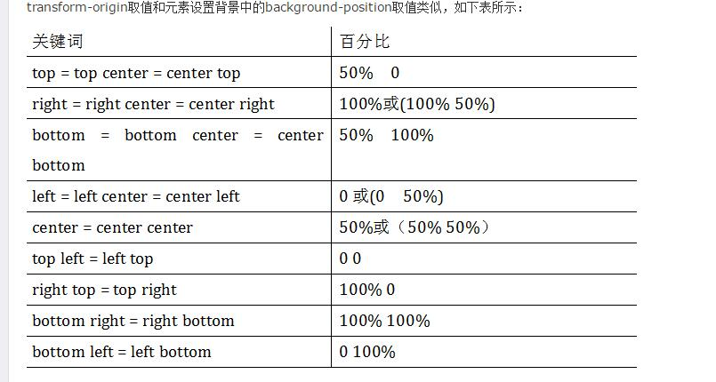

###主要运用知识点
####1、
	border-radius:左上 右上  右下  左下
	box-shadow:-10px 0 10px red, /*左边阴影*/
            10px 0 10px yellow, /*右边阴影*/
            0 -10px 10px blue, /*顶部阴影*/
            0 10px 10px green; /*底边阴影*/
            /*左（负）右、上（负）下*/
	animation: hammerAct 2s cubic-bezier(.8,.22,.23,.9) infinite;
####2、
	transform-origin

####3、
	animation: hammerAct 2s cubic-bezier(.8,.22,.23,.9) infinite;
	//其中，cubic-bezier(.8,.22,.23,.9)为贝塞尔曲线,代表运动速度（ease
	\easeInOut\linear....）
	可参照链接 http://cubic-bezier.com/#.17,.67,.83,.67
	
####4、
	animation-delay:inherit //可继承父级动画延迟时间

####5、
	transform: rotate(1turn); //1turn为360deg
	
	

